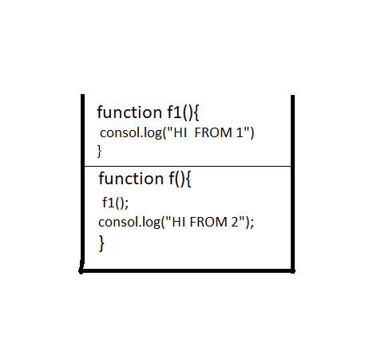

# In memory storage

1. What is a ‘call’?

   At the most basic level, a call stack is a data structure that uses the Last In, First Out (LIFO) principle to temporarily store and manage function invocation (call).

   To invoke a routine in a programming language. Calling a routine consists of specifying the routine name and, optionally, parameters.

2. How many ‘calls’ can happen at once?

   It is single-threaded. Meaning it can only do one thing at a time.

3. What does LIFO mean?

   Last In, First Out data structure

4. Draw an example of a call stack and the functions that would need to be invoked to generate that call stack.

5. What causes a Stack Overflow?

A stack overflow occurs when there is a recursive function (a function that calls itself ) without an exit point.

## JAVASCRIPT ERROR MESSAGE

1. What is a ‘reference error’?

   This is as simple as when you try to use a variable that is not yet declared

2. What is a ‘syntax error’?

   this occurs when you have something that cannot be parsed in terms of syntax

3. What is a ‘range error’?

   this kind of errors will show up when an invalid length given for example a negative length of array

4. What is a ‘type error’?

   this types of errors show up when the types (number, string and so on) you are trying to use or access are incompatible

5. What is a breakpoint?

   a point in the program where the code will stop executing.

6. What does the word ‘debugger’ do in your code?

   is a computer program used to test and debug other programs
